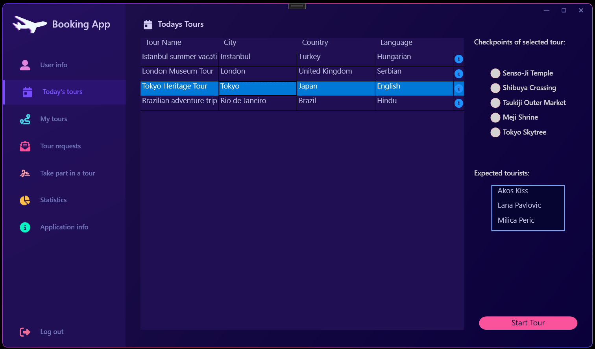
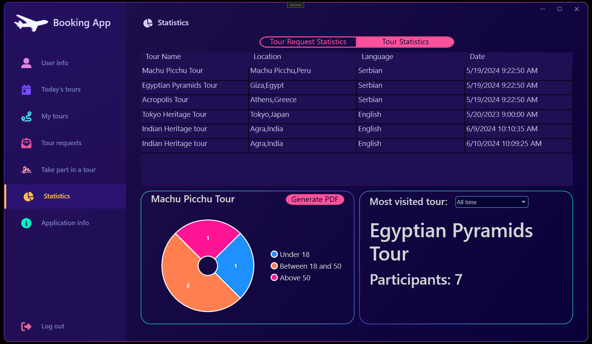
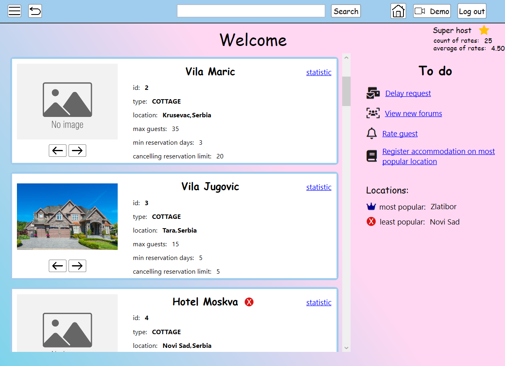
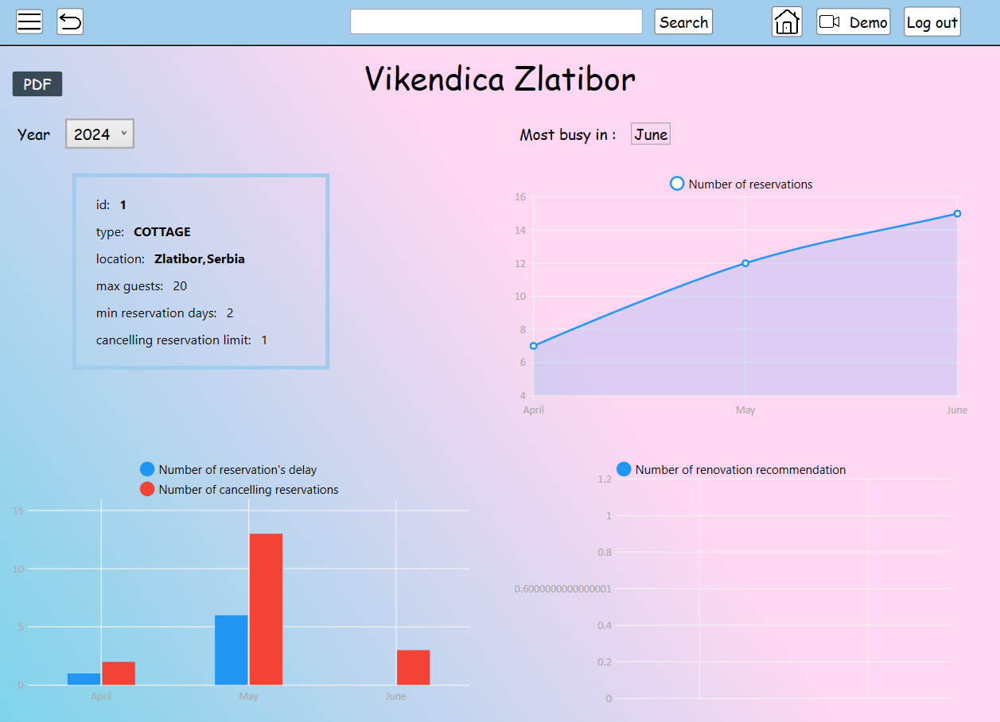
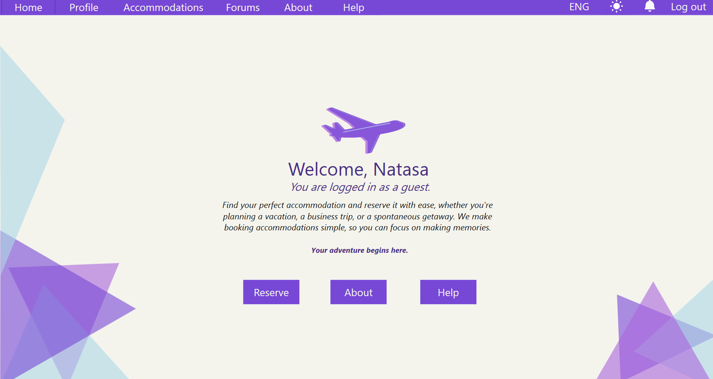
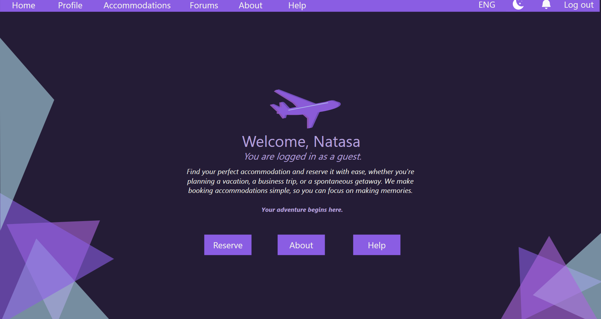
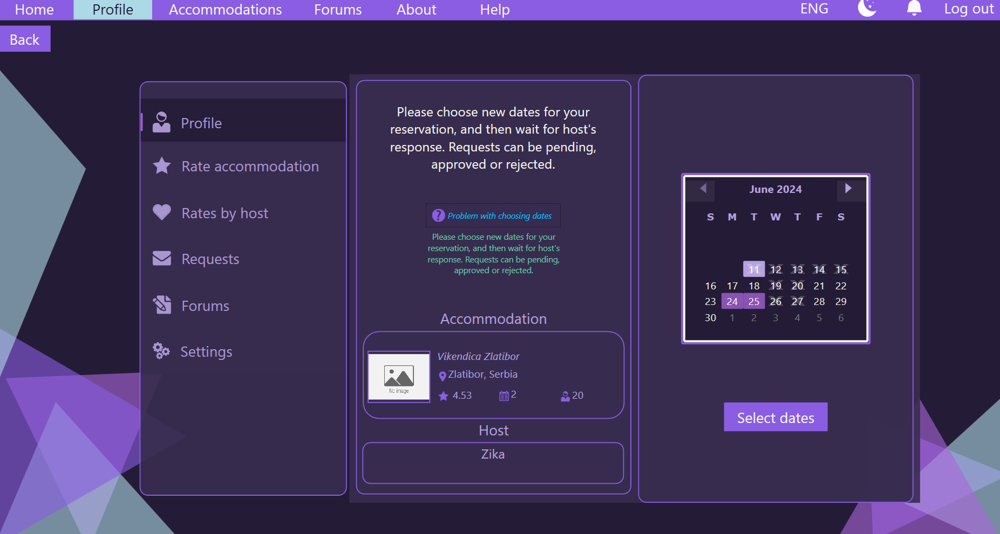
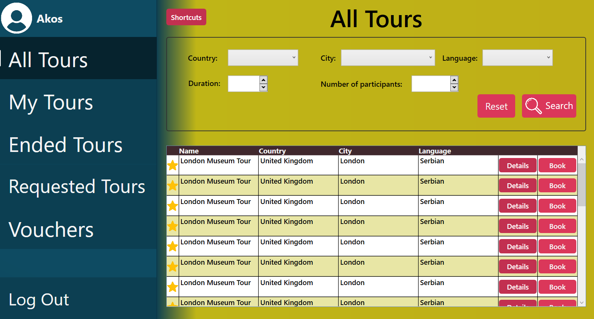
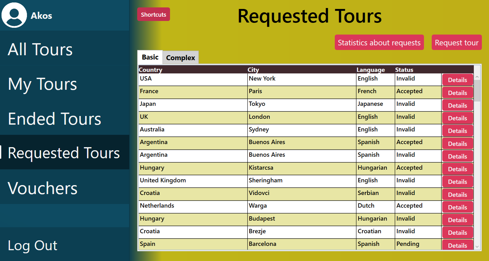
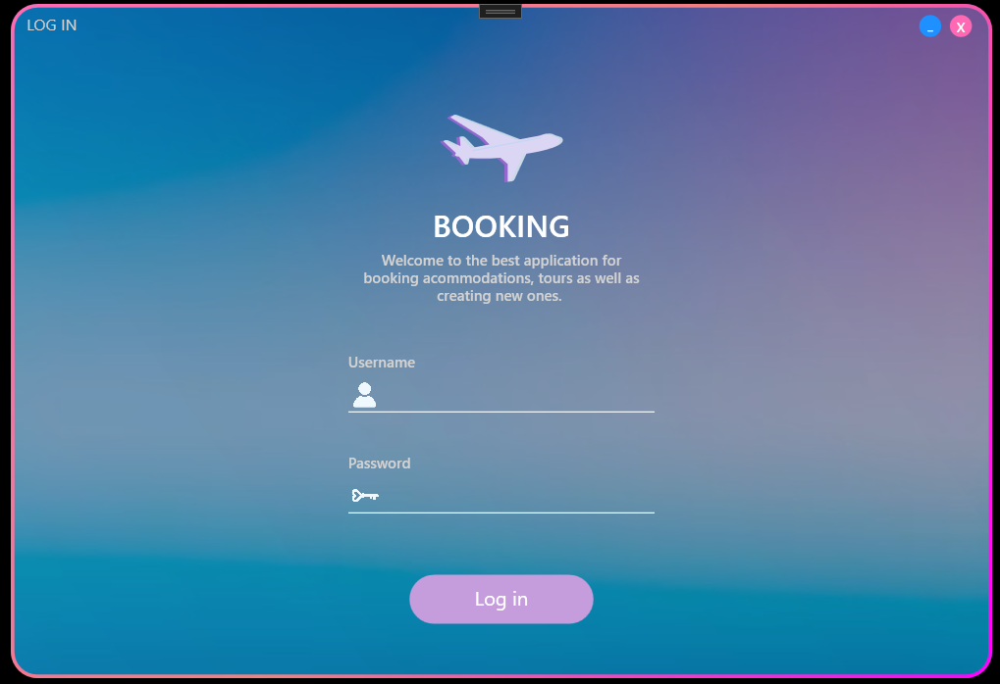

# Booking

Visoko ocenjeni akademski projekat iz predmeta Specifikacija i modeliranje softvera i Interakcija čovek računar na Fakultetu tehničkih nauka. Aplikacija **Booking** omogućava korisnicima da jednostavno rezervišu smeštaj i prateće usluge, pružajući intuitivno korisničko iskustvo za različite tipove korisnika.

## O Projektu

Aplikacija **Booking** je WPF aplikacija koja prati principe čistog koda (clean code), dizajn paterne, kao i MVVM arhitekturu. Cilj aplikacije je da omogući rezervaciju smeštaja i pratećih usluga za različite tipove korisnika.

Aplikacija podržava četiri tipa korisnika:
- **Vlasnik smeštaja**
- **Gost (posetilac smeštaja)**
- **Vodič**
- **Turista**

Za potrebe logovanja, informacije o korisnicima mogu se pronaći u fajlu `Resources/Data/user.csv`.

## Implementacija

Projekat implementira ključne softverske principe i tehnike, uključujući:
- **Principi čistog koda (Clean Code)**
- **SOLID principi**
- **Dizajn paterne**
- **MVVM arhitektura**

Aplikacija takođe sadrži četiri vrste dijagrama za vizualizaciju i bolji uvid u arhitekturu i tokove unutar sistema:
- **Use Case dijagrami**
- **Class dijagrami**
- **Sequence dijagrami**
- **Activity dijagrami**

## Struktura Projekta

- **Application**: Sadrži servise podeljene u tri grupe:
  - **Feature Services**
  - **Rate Services**
  - **Reservation Services**

- **Diagrams**: Folder koji sadrži dijagrame slučajeva korišćenja, klasne dijagrame, dijagrame sekvenci i dijagrame aktivnosti.

- **Domain**: Sadrži modele i interfejse za repozitorijume.

- **Injektor**: Sadrži konfiguraciju za dependency injection.

- **LocalisationResources**: Sadrži resurse za lokalizaciju.

- **Observer**: Implementacija observer paterna.

- **Properties**: Sadrži konfiguracione fajlove.

- **Repository**: Sadrži repozitorijume podeljene u tri grupe:
  - **Feature Repositories**
  - **Rate Repositories**
  - **Reservation Repositories**

- **Resources**: Sadrži podatke i PDF primere:
  - **Data**: CSV fajlovi sa podacima.
  - **PDF Examples**: Primeri generisanih PDF fajlova.

- **Serializer**: Sadrži logiku za serijalizaciju podataka.

- **Styles**: Svi stilovi korišćeni tokom cele aplikacije.

- **Utilites**: PDF generator i pomoćne funkcionalnosti za menjanje tema.

- **WPF**: Glavni folder za WPF resurse i komponente:
  - **Resources/Images**: Sadrži slike korišćene u aplikaciji.
  - **Windows**: Glavni prozori aplikacije.
  - **Pages**: Stranice aplikacije.
  - **User Controls**: Korisnički kontroleri, podeljeni po ulogama.
  - **ViewModels**: View modeli za MVVM arhitekturu.

## Korišćeni alati

- **Microsoft Visual Studio**
- **Balsamiq Wireframes**

## Korišćeni NuGet Paketi

- **DotNetProjects.WpfToolkit.DataVisualization** (v6.1.94)
- **Extended.Wpf.Toolkit** (v4.6.0)
- **FontAwesome.Sharp** (v6.3.0)
- **iTextSharp** (v5.5.13.3)
- **LiveCharts** (v0.9.7)
- **LiveCharts.WinForms** (v0.9.7.1)
- **Microsoft.Xaml.Behaviors.Wpf** (v1.1.77)
- **MVVMLight.Messaging** (v1.0.0)
- **MvvmLightLibs** (v5.4.1.1)
- **LiveCharts.Wpf** (v0.9.7)
- **OxyPlot.Pdf** (v2.1.2)
- **OxyPlot.SkiaSharp** (v2.1.2)
- **QuestPDF** (v2024.3.10)
- **Syncfusion.Pdf.NET** (v25.2.3)
- **WPF-UI** (v3.0.4)

## Prilagođavanje Aplikacije Korisnicima

### Vodič
Deo aplikacije za vodiča je dizajniran za korisnika koji je u ranim 30-im godinama i kojem je potrebna automatizacija poslovnih procesa. Ova sekcija uključuje funkcionalnosti kao što su upravljanje turama, praćenje rezervacija i komunikacija sa turistima.

### Turista
Deo aplikacije za turiste je prilagođen starijim osobama koje se ne snalaze dobro sa računarima i plaše se da ne naprave grešku. Interfejs je jednostavan, sa jasnim uputstvima i velikim dugmadima za lakšu navigaciju.

### Vlasnik smeštaja
Deo aplikacije za vlasnika smeštaja je prilagođen potrebama iskusnih osoba koje imaju ograničeno vreme. Ova sekcija omogućava jednostavno upravljanje rezervacijama, pregled statistike o smeštaju i komunikaciju sa gostima.

### Gost
Deo aplikacije za gosta je prilagođen osobi koja se tek navikava na rad sa računarom i oslanja se na sisteme pomoći. Interfejs pruža intuitivnu navigaciju i jasne instrukcije za korišćenje.

## Autori

- **Teodora Bečejac, RA 37/2021**
- **Katarina Petrović, RA 17/2021**
- **Nataša Radmilović, RA 20/2021**
- **Akoš Kiš, RA 11/2021**

## Galerija Screenshotova Aplikacije

Ovde možete videti izgled glavnih delova aplikacije podeljene po ulogama.

### Vodič

### Vlasnik smeštaja

### Gost

### Turista

### Login prozor

